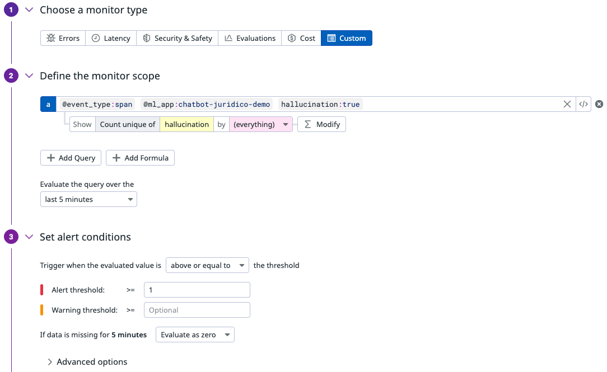
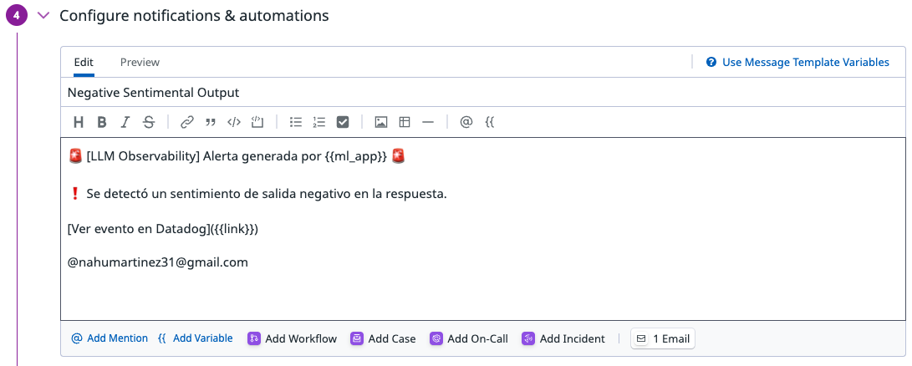

**Sistema de observabilidad para modelos de lenguaje en producción**. Utiliza [Datadog LLM Observability](https://docs.datadoghq.com/llm_observability) para trazar, evaluar y monitorear interacciones con modelos como GPT-4, permitiendo detectar alucinaciones, medir calidad y calcular costos reales por consulta.

---

## 📌 ¿Por qué LLMwatch?

Los modelos de lenguaje son potentes, pero en producción funcionan como cajas negras:
- ¿La respuesta fue correcta?
- ¿Inventó algo?
- ¿Cuánto costó?
- ¿Cuántos tokens se usaron?
- ¿Qué pasa si falla muchas veces?

**LLM Watch** responde todas esas preguntas en tiempo real y las muestra en dashboards operativos con alertas configurables.

---

## 🚀 ¿Qué hace LLM Watch?

- Interactúa con **GPT-4 (OpenAI API)**
- Evalúa automáticamente cada respuesta usando el mismo modelo
- Toma métricas clave como:
  - ✅ Calidad (`evaluation_score`)
  - ❌ Alucinación (`hallucination`)
  - 💸 Costo estimado en USD
  - 📦 Tokens usados (input/output)
  - 🧠 Sentimiento y toxicidad (opcional)
- Envía trazas completas a **Datadog**
- Visualiza todos los datos en dashboards interactivos
- Configura alertas si:
  - Se generan varias alucinaciones en poco tiempo
  - Se excede un costo por respuesta
  - La calidad baja debajo de cierto umbral

---

## 📊 Métricas trazadas en Datadog

| Campo               | Descripción                                          |
|---------------------|------------------------------------------------------|
| `evaluation_score`  | Puntaje automático de calidad (0–1)                  |
| `hallucination`     | Si la respuesta contiene invenciones (True/False)   |
| `estimated_cost_usd`| Costo real de la consulta basado en tokens usados   |
| `input_tokens`      | Tokens usados en el prompt                           |
| `output_tokens`     | Tokens generados por la respuesta                    |
| `user_type`         | Tipo de usuario simulando la consulta                |
| `scenario`          | Tipo de pregunta (ambigua, absurda, legal real, etc)|
| `modelo`            | Modelo usado (gpt-4, gpt-4o, etc)                    |

---

## 📦 Cómo ejecutar el proyecto

### 1. Cloná el repositorio

- git clone https://github.com/CreAI-mx/llm-watch-datadog.git
- cd llm-watch-datadog

### 2. Crea un archivo .env con las siguientes varibles

- OPENAI_API_KEY=tu-api-openai
- DD_API_KEY=tu-api-datadog
- DD_SITE=datadoghq.com
- DD_LLMOBS_ENABLED=1
- DD_LLMOBS_AGENTLESS_ENABLED=1
- DD_LLMOBS_ML_APP=nombre-de-tu-app

### 3. Instala las dependencias

pip install -r requirements.txt

### 4. Ejecuta el Chatbot

python chatbot.py

### 5. Configuración Monitor Scope en DataDog

### 6. Configuración Notifications en DataDog

